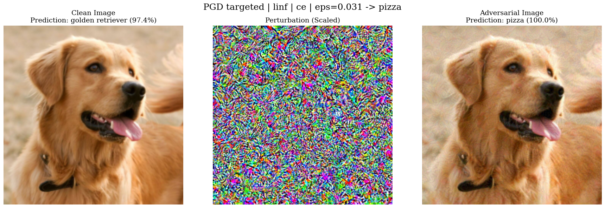

# Adversarial Attacks and Defenses

Project code for Programming Assignment 1 for 15-783: Trustworthy AI - Theory & Practice (Fall 2025).

## Repository structure

- `part_1.py` - Part 1 experiments (find smallest epsilon that breaks an ImageNet classifier).
- `attacks/`
  - `fgsm.py` - FGSM attack
  - `pgd.py` - PGD attack and helpers
  - `loss.py` - CE/CW loss utilities
- `models/`
  - `resnet18_l2_eps0.ckpt` - ResNet-18 model trained without any adversarial training.
- `tests/`
  - `demo.py` - Single-image demo that generates example adversarial images.
- `requirements.txt` - Python dependencies.

Note: Code downloads ImageNet labels, the ImageNet-1K validation set (HF datasets), and torchvision weights on first run (internet required).

## Setup

```bash
python3 -m venv .venv
source .venv/bin/activate
pip install -r requirements.txt
```

## Part 1 - ImageNet: Smallest Epsilon That Breaks the Model

Runs PGD on 100 correctly classified val images with:

- Attacks: untargeted and targeted (random non-true target per image).
- Norms: L-inf and L2.
- Losses: Cross-Entropy (CE) and Carlini-Wagner margin (CW).
- Hyperparameters: PGD steps = 40, step size = epsilon/4.
- epsilon grids:
  - L-inf: {0, 1/255, ..., 8/255}
  - L2: 10 points in [0, 3.0]
- If ASR < 100% at the grid max, the sweep auto-extends epsilon.

Run:

```bash
python3 part_1.py
```

Outputs (saved to `results/part_1/`):

- Tables: median epsilon\* for each setting printed to stdout.
- Plots: `asr_untargeted_linf.png`, `asr_untargeted_l2.png`, `asr_targeted_linf.png`, `asr_targeted_l2.png`.
- Example attacked image: `example_attack.png`.

GPU will be used if available (`cuda`), otherwise CPU.

Example targeted PGD (L-inf, CE) generated by `tests/demo.py`:



## Part 2 - Adversarial Training on MNIST

TODO:

- Implement Baseline, FGSM adversarial training (epsilon=0.3), and TRADES (beta=6, 1-step KL-FGSM).
- Report accuracy vs. epsilon in {0, 0.1, 0.2, 0.3}.

## Part 3 - Adversarial Suffixes for LMs (GCG)

TODO:

- Implement GCG-style suffix optimizer and run universality/transferability experiments.
- Log objective vs. iterations and report ASR.
