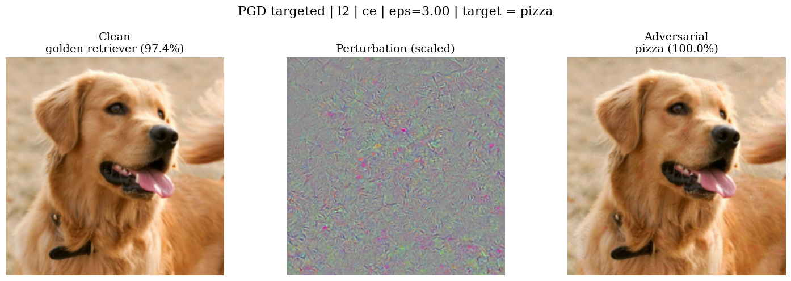

# Adversarial Attacks and Defenses

Project code for Programming Assignment 1 for 15-783: Trustworthy AI - Theory & Practice (Fall 2025).

## Repository structure

- `part_1.py` - Part 1 experiments (find smallest epsilon that breaks an ImageNet classifier).
- `part_2.py` - Part 2 experiments (adversarial training on MNIST).
- `model.py` - Model definitions (ResNet-18 for ImageNet, simple CNN for MNIST).
- `train.py` - Training and evaluation code for MNIST models.
- `attacks/`
  - `fgsm.py` - FGSM attack
  - `pgd.py` - PGD attack and helpers
  - `loss.py` - CE/CW loss utilities
- `models/`
  - `resnet18_l2_eps0.ckpt` - ResNet-18 model trained without any adversarial training.
- `tests/`
  - `demo.py` - Single-image demo that generates example adversarial images.
- `requirements.txt` - Python dependencies.

## Setup

```bash
python3 -m venv .venv
source .venv/bin/activate
pip install -r requirements.txt
```

## Part 1 - ImageNet: Smallest Epsilon That Breaks the Model

Runs PGD on 100 correctly classified val images with:

- Attacks: untargeted and targeted (random non-true target per image).
- Norms: L-inf and L2.
- Losses: Cross-Entropy (CE) and Carlini-Wagner margin (CW).
- Hyperparameters: PGD steps = 40, step size = epsilon/4.
- epsilon grids:
  - L-inf: {0, 1/255, ..., 8/255}
  - L2: 10 points in [0, 3.0]
- If ASR < 100% at the grid max, the sweep auto-extends epsilon.

Run:

```bash
python3 part_1.py
```

Outputs (saved to `results/part_1/`):

- Tables: median epsilon\* for each setting printed to stdout.
- Plots: `asr_untargeted_linf.png`, `asr_untargeted_l2.png`, `asr_targeted_linf.png`, `asr_targeted_l2.png`.
- Example attacked image: `example_attack.png`.

Example targeted PGD (L-2, CE) generated by `tests/demo.py`:



## Part 2 - Adversarial Training on MNIST

Trains three MNIST models and reports robustness via FGSM accuracy:

- Baseline (standard training on clean data).
- FGSM adversarial training (epsilon=0.3).
- TRADES (beta=6.0, 1-step KL-FGSM, epsilon=0.3 for inner step).

Evaluation: train for 100k steps, then test accuracy under FGSM at epsilons {0.0, 0.1, 0.2, 0.3}. Results are saved to CSV and a plot is generated.

Run:

```bash
python3 part_2.py
```

Key options (defaults in parentheses):

- `--max-steps` (100000): optimisation steps per training regime.
- `--log-every` (500): logging frequency in steps.
- `--output-dir` (`results/part_2`): directory for outputs.
- `--analysis`: load results from CSV and only generate the plot.
- `--results-csv` (`<output-dir>/results.csv`): path to CSV file.

Outputs (under `results/part_2/` by default):

- `results.csv`: rows with columns `[regime, epsilon, accuracy]`.
- `accuracy_vs_epsilon.png`: line plot comparing Baseline, FGSM-trained, and TRADES across epsilons.
- Tables of accuracies per epsilon for each regime are printed to stdout.

## Part 3 - Adversarial Suffixes for LMs (GCG)

TODO:

- Implement GCG-style suffix optimizer and run universality/transferability experiments.
- Log objective vs. iterations and report ASR.

## References

Our attack implementations are heavily adapted from:

- [MNIST Challenge](https://github.com/MadryLab/mnist_challenge)
- [CleverHans](https://github.com/cleverhans-lab/cleverhans)
